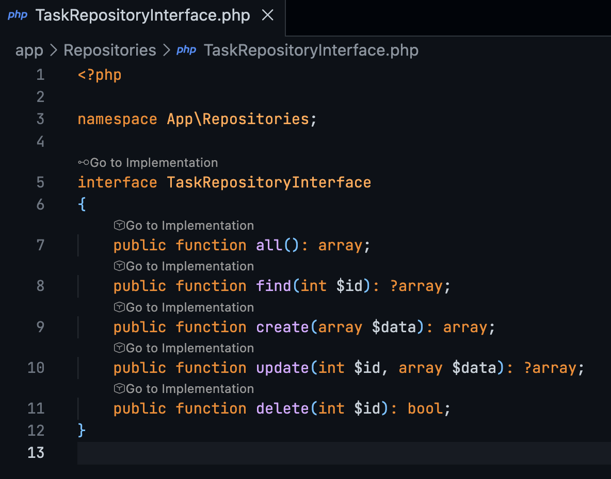

# PHP Interface Definition

Navigate to implementations of PHP interfaces directly from the definition.

## Features

### Go to Implementation CodeLens

A **Go to Implementation** link appears above every `interface` definition in your PHP files.

- **Clicking the link**:
    -   Starts searching for classes that implement the interface.
    -   **Lazy Loading**: Results appear immediately as they are found, so you don't have to wait for the entire search to complete.
    -   **Loading Indicator**: A "Searching..." item shows you that the search is still in progress.
    -   If there is **one** implementation, you are taken directly to it (after search completes).
    -   If there are **multiple** implementations, a list appears for you to choose from.

### Go to Method Implementation CodeLens

A **Go to Implementation** link also appears above every method defined within an interface.

- **Clicking the link**:
    -   Searches for the implementation of **that specific method** in the classes that implement the interface.
    -   Navigates directly to the method definition in the implementing class.

## Requirements

This extension requires a PHP project open in VS Code.

> [IMPORTANT!]
> This extension relies on VS Code's reference provider API. You **must** have a PHP Language Server extension installed and active (e.g., **PHP Intelephense** or **PHP IntelliSense**) for it to work.
>
> Also, ensure that your project files are **indexed** by the PHP extension. If you just opened the project, give it a moment to index.
